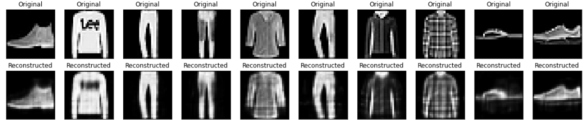
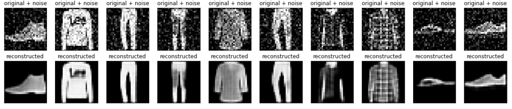
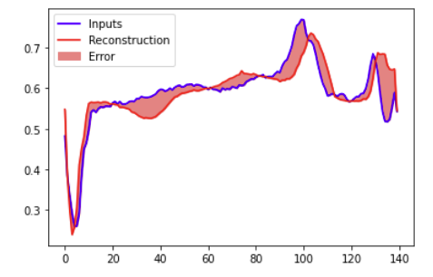
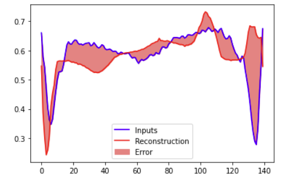

# Autoencoder

Autoencoder is a neural network that learns to encode the given inputs and tries to recreate the input as the output, minimizing the reconstruction error. Eventually it tries to compress the input data.

## Types of Autoencoder Used for:
1) Basic Autoencoder

    In this example the network is supposed to recreate the input image, by down-sampling them into a latent space with `64` dimension and expected to up-sample the same into the original image.

In the below eg., Images were passed to the network, being converted (encoded) into latent space and decoded back to original.

    

 

2) De-noise Autoencoder

    In this example, random gaussian noise is added to the image by a `noise_factor`. The network is expected to remove the noise from the images. 

    The training is done by keeping the training data as the noisy images and the training labels are kept as the original images. What this means is that the network is training itself to remove the noise at the time of reconstruction.

    

 

3) Anomaly Detection

    In this example ECG data is being used, which comprises of anomalous data points. The data is properly labelled to help us train the model exactly as we want, i.e., Only on Normal Data. 

    Later on we train the Autoencoder with only normal train data, and tune it accordingly to reconstruct it back. The reconstruction error serves as a threshold to predict if the data is normal or anomalous.

<table>
    <tr>
        <th>
Original
</th>
        <th>
Anomaly
</th>
    </tr>
    <tr>
        <td>
            

                
            

        </td>
        <td>
            

                
            

        </td>
    </tr>
</table>
   

 

